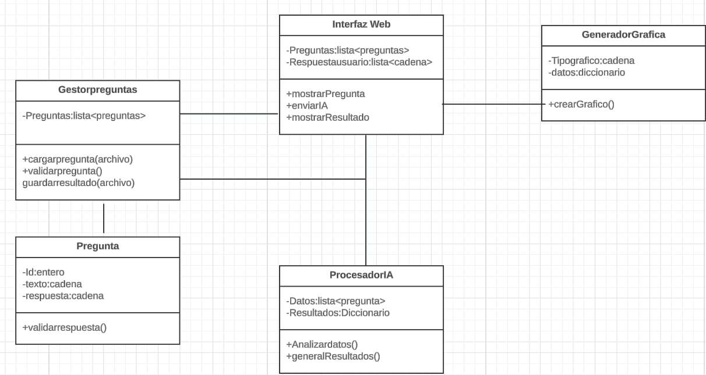

# Manual de Usuario - Test Vocacional

## Introducción
El sistema de test vocacional está diseñado para orientar a los usuarios en la elección de una carrera universitaria. Combina una página web interactiva con una inteligencia artificial (IA) que analiza las respuestas del usuario y genera gráficos que representan los resultados.

## Diagrama de clases


## Preguntas Frecuentes (FAQ)
1. ¿Qué hago si falta una pregunta?
    - El sistema validará automáticamente y mostrará un error si encuentra inconsistencias.
2. ¿Cómo interpretar los gráficos?
    - Cada barra/punto en el gráfico representa la afinidad a una categoría o carrera específica.

## Guía de Instalación
### Requisitos Previos
- Python (versión 3.8 o superior).
- Librerías de Python: sklearn y pandas.
- Node.js (para el frontend) o descargar la pagina en tu ordenadr.
- Navegador web moderno (Chrome, Firefox, Edge).

## Sistema Operativo compatible:
- Windows 10/11, macOS, o Linux.

## Instalación de python(Configuración de la Inteligencia Artificial )
La IA procesa los datos de entrada, válida las respuestas y genera los resultados.
1. Instalar Python:
    - Descarga Python desde [python.org](https://www.python.org/downloads/).
    - Durante la instalación, asegúrate de marcar la opción Add Python to PATH.
2. Configurar el entorno Python:
    - Abre una terminal o línea de comandos.
    - Crea un entorno virtual en caso de usar una verci&#243;n de linux 21 en adelante:
        - comando para instalar el entorno virtual
        
        ```
        sudo apt install python3-venv

        sudo dnf install python3-venv
        ``` 
        - Comando para instalarlo en la carpeta raiz
        
        ```
        python3 -m venv .venv
        ```

        - Comando para activar el entorno virtual
        ```
        source venv/bin/activate
        ```

## Instalar dependencias
Estos comando se colocan en la consola y le dan enter estos comandos sirven para cualquier sistema operativo que tengan **Python**

- Para instalar pip:

    ```
    sudo apt-get install python-pip <- Python2
    sudo apt-get install python3-pip <- Python3
    ```
- Para instalar sklearn: 

    ```
    pip install -U scikit-learn
    ```
- Para instalar pandas
    ```
    pip install pandas
    ```

## Guía de Uso
### Pasos para Realizar el Test
1. Inicio:
    - Abre el enlace proporcionado: [Ir a la pagina](https://ninjadiaz007.github.io/Blog/ProyectoIA/index.html).
    - Responde las preguntas mostradas seleccionando "Sí" o "No".

2. Procesar Respuestas:
    - Haz clic en el botón "Enviar respuestas".
    - Las respuestas se guardarán en un archivo llamado informacion.txt.

3. Generar Resultados:
    - Carga el archivo informacion.txt en la IA.
    - La IA procesa los datos y genera un nuevo archivo con los resultados.

4. Visualizar Resultados:
    - Regresa a la página web y sube el archivo de resultados.
    - Observa los gráficos generados con Chart.js.
